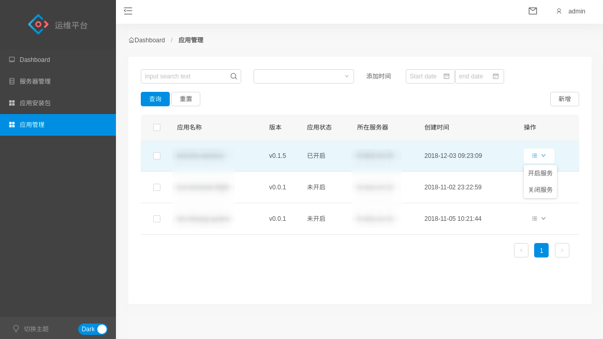

# ops-admin

[ops-admin](https://github.com/slient2010/ops-admin)是基于[ng-ant-admin](https://github.com/robinv8/ng-ant-admin)的后台管理系统二次开发的运维管理平台。主要实现功能是应用创建管理功能。

## 快速开始

确保Node版本>= 6.9.0，NPM版本 >= 3。

```shell

git clone --depth 1 https://github.com/slient2010/ops-admin.git
cd ops-admin
npm install
ng server -o open

```

## 项目截图

